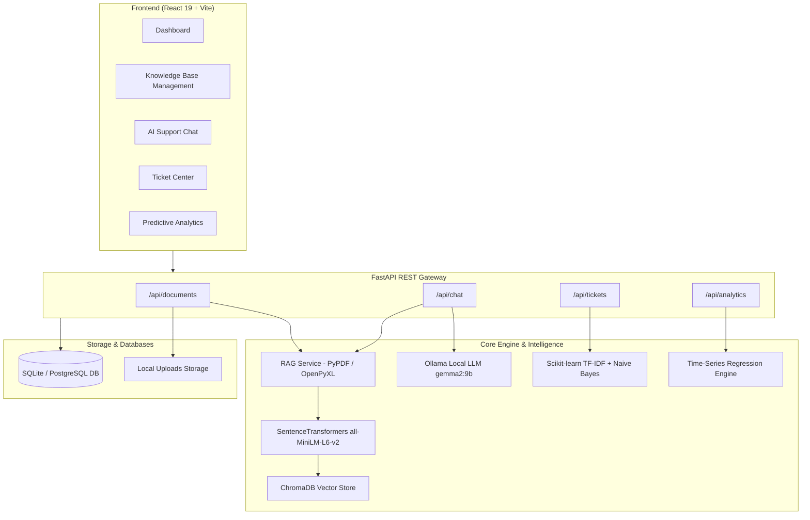

# GenSupportAI: Enterprise AI Customer Support & Knowledge Assistant

GenSupportAI is a full-stack, enterprise-grade AI customer support platform combining **Retrieval-Augmented Generation (RAG)**, **local Large Language Model (LLM) inference**, **automated ML ticket triage**, and **predictive analytics**.

---

## 🌟 Key Features

- **Document Ingestion & RAG Pipeline**:
  - Ingests **PDF**, **Excel (.xlsx, .xls)**, and **CSV** files.
  - Automatically parses, chunks (with configurable overlap), and embeds text using `all-MiniLM-L6-v2` (384 dimensions).
  - High-performance vector similarity search backed by **ChromaDB** with cosine distance metric.
- **Privacy-Preserving Local LLM Chatbot**:
  - Powered by local **Ollama** (`gemma2:9b` / `llama3:8b`).
  - Context-aware prompt engine combining retrieved knowledge chunks and past conversation history.
  - One-click escalation to human support when queries require manual intervention.
- **Machine Learning Support Ticket Triage**:
  - Automated ticket categorization (Technical, Billing, Sales, General) using a **Scikit-learn TF-IDF + Multinomial Naive Bayes** pipeline.
  - Intelligent priority assignment (Critical, High, Medium, Low) derived from query text heuristics and sentiment analysis.
- **Interactive Ticket Center (Kanban / List View)**:
  - Manage open, in-progress, and resolved support tickets.
  - Real-time status filtering and resolution duration logging.
- **Predictive Analytics & Sentiment Dashboard**:
  - Real-time KPI tracking: total chat sessions, open tickets, average resolution speed, user counts.
  - Message sentiment breakdown (Positive, Neutral, Negative).
  - **7-Day Support Queue Forecasting** utilizing time-series linear regression and seasonal weighting.
- **Modern Responsive Dashboard**:
  - Built with **React 19**, **Vite**, **Recharts**, and **Lucide Icons** with a sleek, dark-themed UI.

---

## 🏗️ System Architecture



---

## 🛠️ Technology Stack

| Layer | Technology | Purpose |
|---|---|---|
| **Frontend UI** | React 19, Vite, Recharts, Lucide React, CSS Variables | Responsive, dark-themed single page application |
| **Backend Framework** | FastAPI (Python 3.10+) | High-performance asynchronous REST API |
| **Database ORM** | SQLAlchemy, SQLite / PostgreSQL | Relational data persistence (users, chats, tickets, docs) |
| **Vector Database** | ChromaDB (Persistent Client) | Storing and querying vector embeddings |
| **Embeddings** | SentenceTransformers (`all-MiniLM-L6-v2`) | Text-to-vector embedding generation (384d) |
| **LLM Inference** | Ollama (`gemma2:9b` / `llama3`) | On-premise, zero-data-leakage conversational intelligence |
| **Machine Learning** | Scikit-learn, NumPy | Ticket category classification & 7-day queue volume forecasting |
| **Containerization** | Docker & Docker Compose | Containerized deployment for PostgreSQL, pgAdmin, and Ollama |

---

## 📂 Directory Layout

```text
Project/
├── backend/
│   ├── app/
│   │   ├── config.py              # Environment and system settings
│   │   ├── database.py            # SQLAlchemy database engine & sessions
│   │   ├── main.py                # FastAPI initialization & route mounting
│   │   ├── models/                # SQLAlchemy database models
│   │   │   ├── chat.py            # ChatSession & ChatMessage
│   │   │   ├── document.py        # Document & DocumentChunk
│   │   │   ├── ticket.py          # Ticket model
│   │   │   └── user.py            # User accounts & roles
│   │   ├── routers/               # REST API endpoints
│   │   │   ├── analytics.py       # Metrics, sentiment & forecasting
│   │   │   ├── chat.py            # Session creation, messaging & RAG
│   │   │   ├── document.py        # Upload, ingestion & deletion
│   │   │   └── ticket.py          # Ticket escalation, triage & updates
│   │   ├── schemas/               # Pydantic validation schemas
│   │   │   ├── analytics.py
│   │   │   ├── chat.py
│   │   │   ├── document.py
│   │   │   └── ticket.py
│   │   └── services/              # AI/ML business logic
│   │       ├── analytics_service.py # KPI computation & linear regression forecast
│   │       ├── llm_service.py       # Ollama integration & prompt template
│   │       ├── rag_service.py       # File parsers, chunking & vector search
│   │       └── ticket_service.py    # TF-IDF + Naive Bayes classifier
│   ├── chroma_db/                 # Persistent vector store directory
│   ├── uploads/                   # Document upload directory
│   └── gensupport.db              # SQLite relational database
├── frontend/
│   ├── src/
│   │   ├── pages/                 # UI Views
│   │   │   ├── Analytics.jsx      # KPI statistics & Recharts forecasts
│   │   │   ├── ChatBot.jsx        # Conversational UI with RAG citations
│   │   │   ├── Dashboard.jsx      # System landing & module overview
│   │   │   ├── KnowledgeBase.jsx  # Drag-and-drop document manager
│   │   │   └── TicketCenter.jsx   # Support ticket management board
│   │   ├── services/
│   │   │   └── api.js             # Frontend API client
│   │   ├── App.jsx                # Layout, sidebar & view router
│   │   ├── index.css              # Design system & dark theme styling
│   │   └── main.jsx               # Application entry point
│   ├── package.json
│   └── vite.config.js
├── docker-compose.yml             # PostgreSQL, pgAdmin & Ollama container stack
├── ARCHITECTURE.md                # In-depth system specifications
└── README.md                      # Project documentation
```

---

## ⚡ Getting Started

### 1. Prerequisites
- **Python 3.10+**
- **Node.js 18+** & `npm`
- **Ollama** installed locally ([ollama.com](https://ollama.com))

### 2. Setting Up Ollama LLM
Ensure Ollama is running and download the default model:
```bash
ollama serve
ollama pull gemma2:9b
```
*(Alternatively, `llama3:8b` can be configured via `LLM_MODEL` in `.env`)*

### 3. Backend Setup
1. Open a terminal in the `backend/` directory:
   ```bash
   cd backend
   ```
2. Create and activate a Python virtual environment:
   ```bash
   # Windows
   python -m venv venv
   .\venv\Scripts\activate

   # Linux/macOS
   python3 -m venv venv
   source venv/bin/activate
   ```
3. Install dependencies:
   ```bash
   pip install fastapi uvicorn pydantic pydantic-settings sqlalchemy chromadb sentence-transformers pypdf openpyxl scikit-learn numpy requests
   ```
4. Start the backend server:
   ```bash
   uvicorn app.main:app --reload --port 8000
   ```
   The FastAPI interactive documentation will be available at: `http://localhost:8000/docs`

### 4. Frontend Setup
1. Open a new terminal in the `frontend/` directory:
   ```bash
   cd frontend
   ```
2. Install node packages:
   ```bash
   npm install
   ```
3. Launch the Vite development server:
   ```bash
   npm run dev
   ```
4. Access the web interface at: `http://localhost:5173`

---

## 📡 API Reference Summary

### Documents & Knowledge Base (`/api/documents`)
- `POST /api/documents/upload` - Upload PDF, Excel, or CSV for asynchronous chunking and vector indexing.
- `GET /api/documents` - List all uploaded documents with status (`processing`, `indexed`, `failed`) and chunk counts.
- `DELETE /api/documents/{document_id}` - Delete document record, source file, and associated vector embeddings.
- `GET /api/documents/search?query={q}&limit={n}` - Test vector similarity search directly.

### Chat & LLM Assistant (`/api/chat`)
- `POST /api/chat/session` - Create a new chat session.
- `GET /api/chat/sessions` - Retrieve list of previous chat sessions.
- `GET /api/chat/session/{session_id}/messages` - Fetch full message history for a session.
- `POST /api/chat/message` - Send user message, execute RAG retrieval, invoke Ollama LLM, and store response.

### Support Ticket Management (`/api/tickets`)
- `POST /api/tickets/escalate` - Escalate a chat session into a support ticket with ML-predicted category and priority.
- `GET /api/tickets` - List tickets with optional filters (`status`, `category`, `assigned_agent_id`).
- `PATCH /api/tickets/{ticket_id}/status` - Update ticket status (`open`, `in_progress`, `resolved`).
- `PATCH /api/tickets/{ticket_id}/assign` - Assign a ticket to a support agent.

### Analytics & Projections (`/api/analytics`)
- `GET /api/analytics/dashboard` - High-level KPIs (Total chats, Open tickets, Avg resolution time in hours, User count).
- `GET /api/analytics/sentiment` - Aggregated user sentiment distribution (Positive, Neutral, Negative counts and ratios).
- `GET /api/analytics/forecasting` - 7-day predicted support queue volume using time-series linear regression.

---

## 🔒 Configuration & Environment Variables

Create or edit `backend/.env`:

```env
PROJECT_NAME="GenSupportAI"
DATABASE_URL="sqlite:///./gensupport.db"
UPLOAD_DIR="./uploads"
CHROMA_DB_DIR="./chroma_db"
EMBEDDING_MODEL_NAME="all-MiniLM-L6-v2"
CHUNK_SIZE=800
CHUNK_OVERLAP=150
OLLAMA_URL="http://localhost:11434"
LLM_MODEL="gemma2:9b"
OLLAMA_TIMEOUT=90
```

---

## 🐳 Docker Deployment (Optional)

To start PostgreSQL, pgAdmin, and Ollama in containers:
```bash
docker-compose up -d
```
- PostgreSQL: `localhost:5432`
- pgAdmin: `http://localhost:8080` (Default Email: `sivarajsivakumar3108@gmail.com`, Password: `adminpassword`)
- Ollama: `http://localhost:11434`
